# Computer-Vision

## HW1
This assignment was an introduction to OpenCV and its functions like cv2.cvtColor, cv2.line, etc.

## HW2
In this assignment, we must find corners of a chessboard and fix its distortion with OpenCV. Then, in order to fine calibration parameters more accurately, we use more images of a chessboard.

## HW3

In the second question of this assignment, I used historgram equalization techniques. Then I used CLAHE and compared two results.
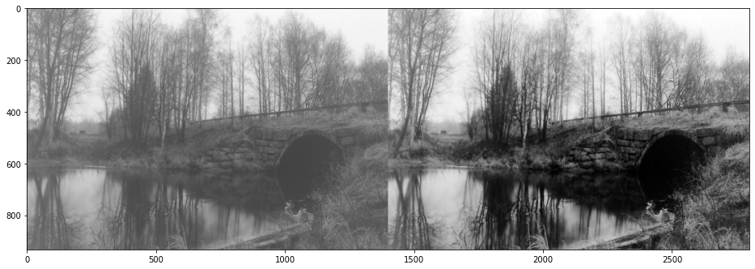 

In the third part, I combined two images with histogram matching.
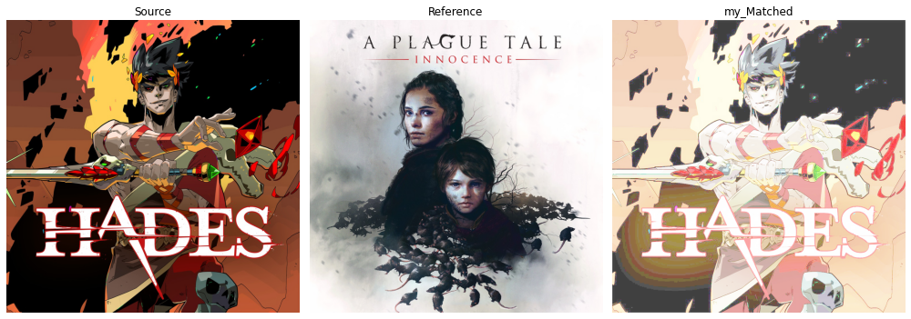 

## HW4

In the third question of this assignment, we designed some filters in order to fix the noise of impute images.
Then, in the next question, we must fix the noise of an image with help of the Fourier transform.

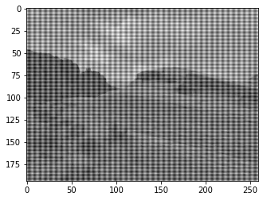 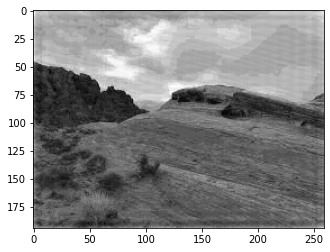 

## HW5

In this assignment we wanted to fix the noise of an input image and detect the edges of objects in the picture. In the other question, we fined the equation of a line wich perfectly fits on the line in a picture.

## HW6

## HW7

In the first question of this assignment, we get some images from a place and combine them.
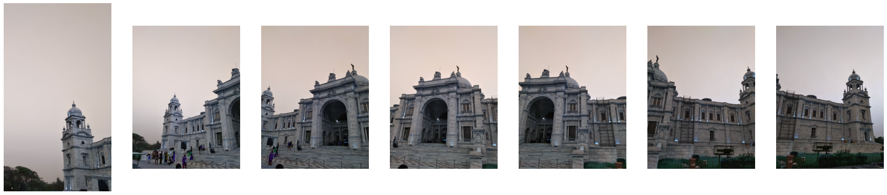

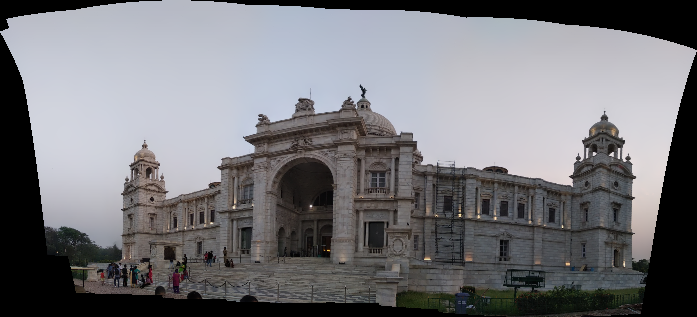

In the third question, we implemented a CamScanner.

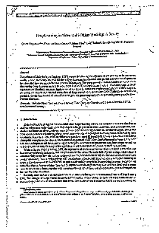

## HW8

In this assignment, we read the Persian text from a given image. I use Adaptive Threshold for this question.

## HW10

In this assignment, we implemented a classifier and we used compactness, eccentricity, solidity, and LBP values as features.

## HW11

First, we implemented two models (one with Conv layers and one without). Then we compared results of these models.
In the next part, we used finetuned Resnet50 after resizing given images.

## Project

### Crack Detection

In this course project, pictures of tiles with some cracks were given, and we must detect the location of the crack. Pictures of the patterns were also given because The pattern of the tiles was very similar to a crack.

I load all images, labels, and patterns in the first step. Then, I used histogram matching to make the picture of the tile and its pattern similar in color. Then, I found the key points in each pair of a tile and a pattern to eliminate the pattern from the tile. After the similarity transform, I subtracted the two images, but there was an issue.

As can be seen from the following images, the lines in the pattern are thicker. Thus, I used morphology techniques to reduce the thickness of the lines in the pattern. (left picture belongs to a pattern, and the right one is the picture of a tile)

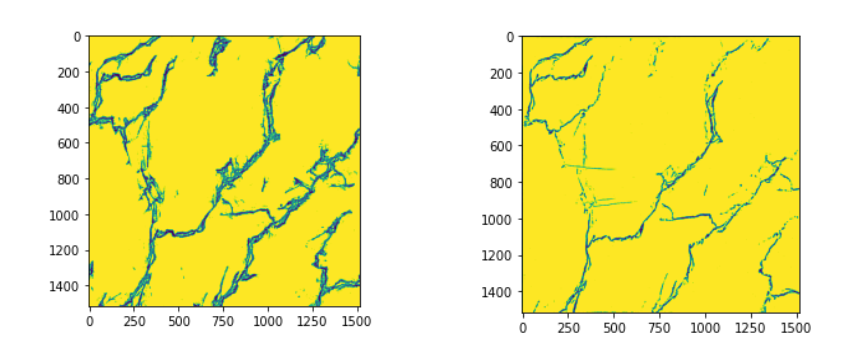 

After morphology and subtraction, I ended up with this result:

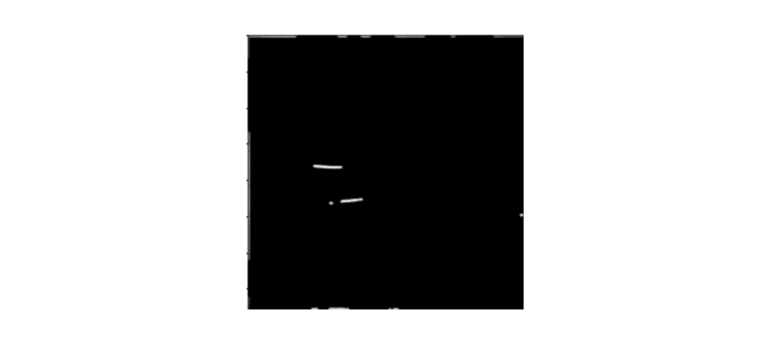 

However, we were able to detect only large cracks. Thus, I decided to reduce the number of iterations and size of the filter in the morphology step. Then, I resized the output to (224, 224) because the input size of the pre-trained Unet, which I used in this project, was (224, 224, 3).

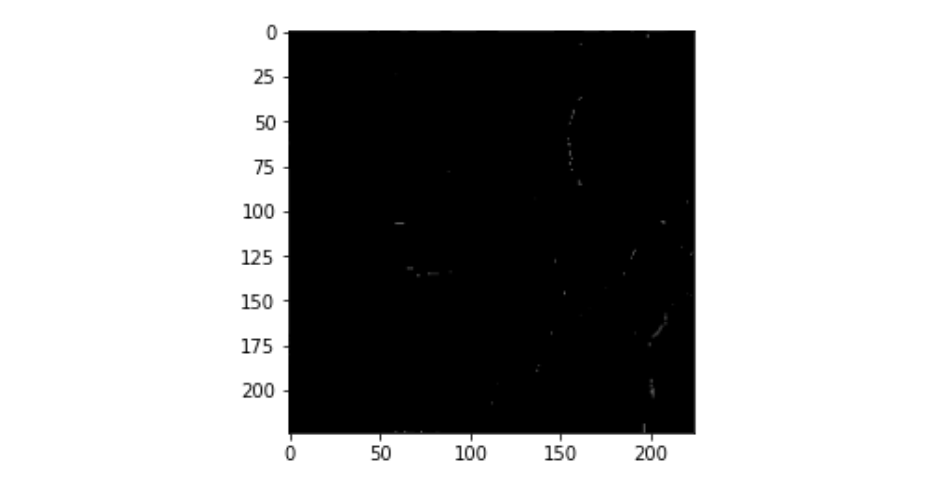 

In the next step, I created labels for my dataset in the desired format for Unet.

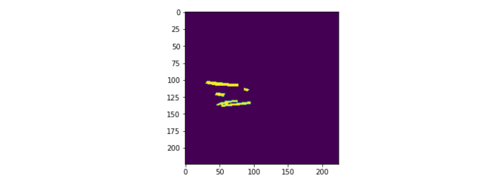 

Then, I used the Unet, which was proposed here by ZFTurbo. In the end, I got this result.

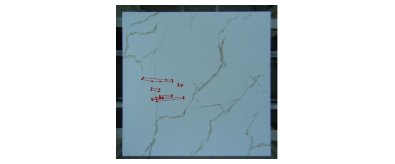 
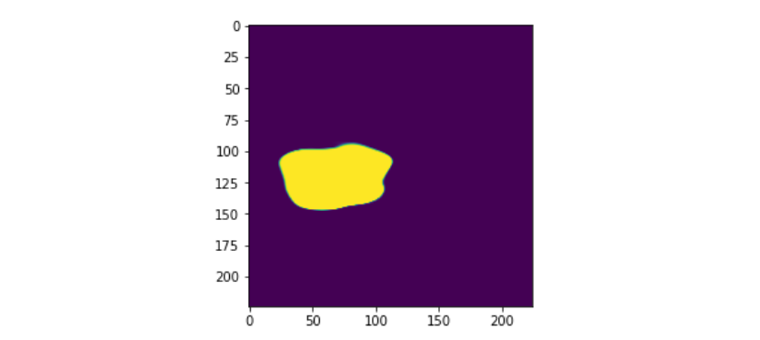 

